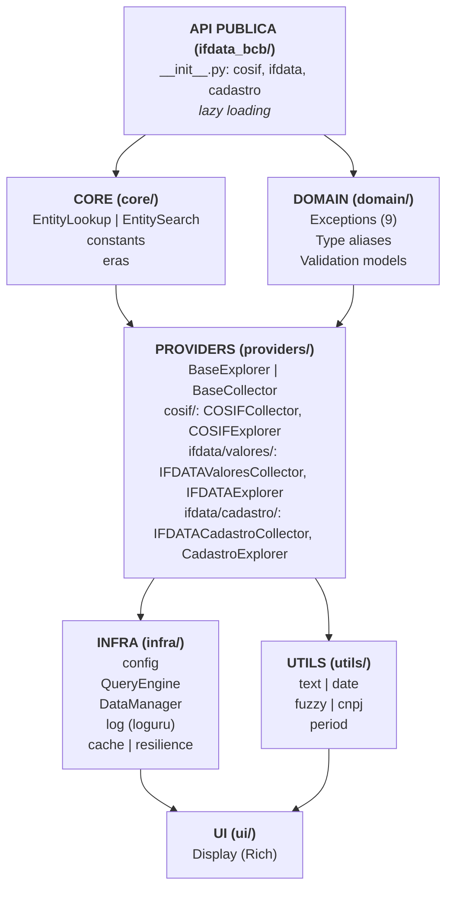
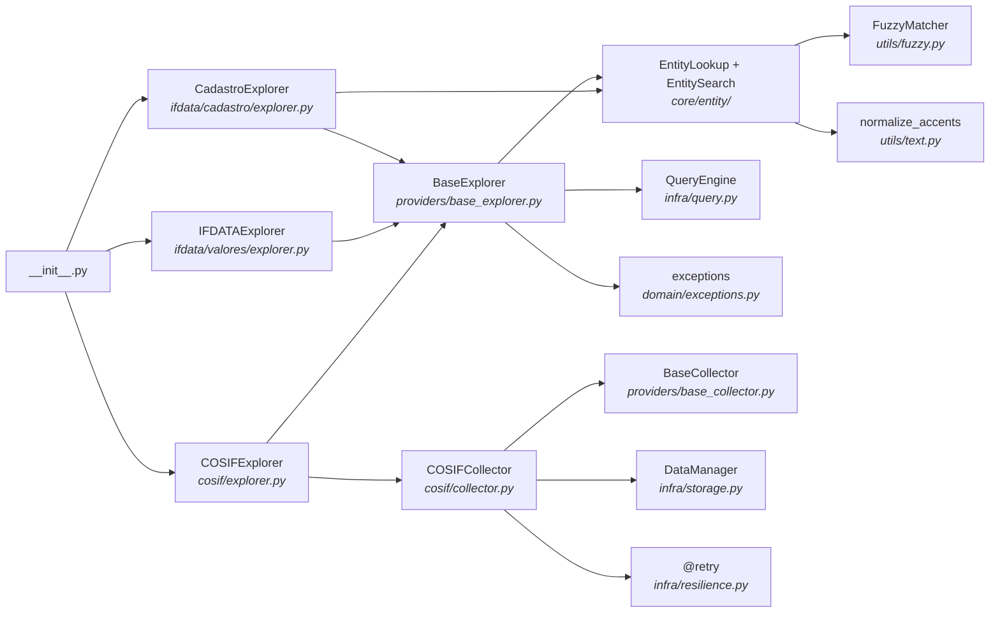

# Arquitetura

Visao geral da arquitetura interna da biblioteca `ifdata-bcb`.

## Diagrama de Camadas



## Estrutura de Diretorios

```
src/ifdata_bcb/
|-- __init__.py               # Entry point (lazy loading)
|-- core/                     # Logica central compartilhada
|   |-- __init__.py
|   |-- entity/              # Resolucao e busca de entidades
|   |   |-- __init__.py      # Re-exports: EntityLookup, EntitySearch
|   |   |-- lookup.py        # EntityLookup (metadados, source checking)
|   |   +-- search.py        # EntitySearch (fuzzy matching)
|   |-- constants.py         # Configuracoes centralizadas
|   +-- eras.py              # Deteccao e tratamento de eras de formato BCB
|-- domain/                   # Modelos e tipos
|   |-- __init__.py
|   |-- exceptions.py        # Hierarquia de excecoes
|   |-- types.py             # DateInput, AccountInput, etc
|   +-- validation.py        # Pydantic models (NormalizedDates, ValidatedCnpj8, etc)
|-- providers/                # Implementacoes por fonte
|   |-- __init__.py
|   |-- base_explorer.py     # Classe base abstrata para explorers
|   |-- base_collector.py    # Template para coleta + CollectStatus enum
|   |-- enrichment.py        # Enriquecimento cadastral inline
|   |-- cosif/               # COSIF (mensal)
|   |   |-- __init__.py
|   |   |-- collector.py     # COSIFCollector
|   |   +-- explorer.py      # COSIFExplorer
|   +-- ifdata/              # IFDATA (trimestral)
|       |-- __init__.py
|       |-- cadastro/        # Dados cadastrais
|       |   |-- __init__.py
|       |   |-- collector.py # IFDATACadastroCollector
|       |   |-- explorer.py  # CadastroExplorer
|       |   +-- search.py    # CadastroSearch (busca com filtros fonte/escopo)
|       +-- valores/         # Dados financeiros (valores)
|           |-- __init__.py
|           |-- collector.py # IFDATAValoresCollector
|           |-- explorer.py  # IFDATAExplorer
|           +-- temporal.py  # TemporalResolver (resolucao temporal por periodo)
|-- infra/                    # Infraestrutura tecnica
|   |-- __init__.py
|   |-- config.py            # Settings (pydantic-settings)
|   |-- paths.py             # ensure_dir, temp_dir
|   |-- query.py             # QueryEngine (DuckDB)
|   |-- sql.py               # Funcoes de construcao SQL (build_string_condition, etc)
|   |-- storage.py           # DataManager (Parquet)
|   |-- log.py               # Logging (Loguru)
|   |-- cache.py             # Cache LRU com registro global
|   +-- resilience.py        # Retry e backoff
|-- ui/                       # Interface visual
|   |-- __init__.py
|   +-- display.py           # Display (Rich)
+-- utils/                    # Utilitarios puros
    |-- __init__.py
    |-- text.py              # normalize_accents, normalize_text
    |-- date.py              # Geracao de ranges, conversoes
    |-- fuzzy.py             # FuzzyMatcher
    |-- cnpj.py              # standardize_cnpj_base8
    +-- period.py            # Extracao de periodos de arquivos
```

## Responsabilidades por Camada

### API Publica (`__init__.py`)

- Ponto de entrada da biblioteca
- Lazy loading de explorers (`cosif`, `ifdata`, `cadastro`)
- Exporta excecoes para tratamento de erros
- Busca de instituicoes via `bcb.cadastro.search()`

### Core (`core/`)

- **EntityLookup**: Resolucao de metadados, source checking, canonical names
- **EntitySearch**: Busca fuzzy de entidades por nome (via FuzzyMatcher)
- **constants**: Mapeamentos centralizados (DATA_SOURCES, TIPO_INST_MAP)
- **eras**: Deteccao e tratamento de eras de formato BCB

### Domain (`domain/`)

- **exceptions**: Hierarquia de 9 excecoes customizadas
- **types**: Type aliases para parametros flexiveis
- **validation**: Pydantic models para normalizacao/validacao de inputs

### Providers (`providers/`)

- **BaseExplorer**: Classe base abstrata com logica compartilhada de leitura
- **BaseCollector**: Template Method para coleta paralela
- **enrichment**: Enriquecimento cadastral inline (`cadastro=` parameter)
- **COSIFExplorer/Collector**: Dados COSIF (mensal)
- **IFDATAExplorer/Collector**: Dados IFDATA Valores (trimestral)
- **CadastroExplorer**: Dados cadastrais IFDATA

### Infra (`infra/`)

- **config**: Settings via pydantic-settings (BACEN_DATA_DIR)
- **paths**: Gerenciamento de diretorios (`ensure_dir`, `temp_dir`)
- **QueryEngine**: Motor DuckDB sobre Parquet
- **sql**: Funcoes de construcao SQL (`build_string_condition`, `build_account_condition`, `build_like_condition`, `join_conditions`, etc)
- **DataManager**: Persistencia em Parquet
- **log**: Dual output (console WARNING+, arquivo DEBUG+), `emit_user_warning`
- **cache**: Decorator `@cached` com registro global
- **resilience**: `@retry` com exponential backoff

### Utils (`utils/`)

- **text**: Normalizacao de acentos e whitespace
- **date**: Conversoes e geracao de ranges de datas
- **fuzzy**: FuzzyMatcher com token_set_ratio
- **cnpj**: Padronizacao CNPJ 8 digitos
- **period**: Extracao de periodos de nomes de arquivo

### UI (`ui/`)

- **Display**: Singleton thread-safe com Rich
- Banners, barras de progresso, mensagens coloridas
- Deteccao automatica de Jupyter

## Design Patterns

### Lazy Loading

Explorers sao carregados sob demanda para startup rapido (~17ms):

```python
# Em __init__.py
_cosif = None

def __getattr__(name):
    global _cosif
    if name == "cosif":
        if _cosif is None:
            from ifdata_bcb.providers.cosif.explorer import COSIFExplorer
            _cosif = COSIFExplorer()
        return _cosif
    # ... ifdata, cadastro analogos
```

### Template Method (BaseCollector)

Define esqueleto da coleta, subclasses implementam detalhes:

```python
class BaseCollector(ABC):
    def collect(self, start, end):
        periods = self._generate_periods(start, end)      # Template
        with ThreadPoolExecutor(max_workers=4) as executor:
            for period in periods:  # Paralelo via executor.submit()
                data = self._download_period(period, work_dir)  # Abstract
                df = self._process_to_parquet(data, period)     # Abstract
                self.dm.save(df, filename, subdir)              # Template

    @abstractmethod
    def _download_period(self, period, work_dir): ...
    @abstractmethod
    def _process_to_parquet(self, data_path, period): ...
```

### Builder Pattern (Condicoes SQL)

Construcao incremental de clausulas WHERE (funcoes em `infra.sql`):

```python
from ifdata_bcb.infra.sql import build_string_condition, join_conditions

conditions = [
    self._build_cnpj_condition(instituicao),     # Pode ser None
    self._build_date_condition(start, end),      # Pode ser None
    build_string_condition(col, conta),          # Pode ser None
]
where = join_conditions(conditions)              # Filtra Nones, junta com AND
```

### Dependency Injection

Explorers aceitam dependencias via construtor:

```python
class COSIFExplorer(BaseExplorer):
    def __init__(
        self,
        query_engine: QueryEngine | None = None,
        entity_lookup: EntityLookup | None = None,
    ):
        self._qe = query_engine or QueryEngine()
        self._resolver = entity_lookup or EntityLookup(query_engine=self._qe)
```

### Registry Pattern (Cache)

Caches registrados globalmente para limpeza centralizada:

```python
_registered_caches: list[Callable] = []

def cached(maxsize: int = 128):
    def decorator(func):
        cached_func = lru_cache(maxsize=maxsize)(func)
        _registered_caches.append(cached_func)
        return cached_func
    return decorator

def clear_all_caches():
    for cache in _registered_caches:
        cache.cache_clear()
```

### Singleton Thread-Safe (Display)

Double-checked locking para instancia unica:

```python
_display_instance = None
_display_lock = threading.Lock()

def get_display():
    global _display_instance
    if _display_instance is None:
        with _display_lock:
            if _display_instance is None:
                _display_instance = Display()
    return _display_instance
```

## Fluxo de Coleta

```
Usuario: bcb.cosif.collect('2024-01', '2024-12')
    |
    v
COSIFExplorer.collect()
    |
    v
COSIFCollector.collect()
    |
    +-- _generate_periods() --> [202401, 202402, ..., 202412]
    |
    +-- ThreadPoolExecutor (4 workers)
        |
        +-- Worker 0: staggered_delay(0) --> 0s
        |   +-- temp_dir() as work_dir
        |   +-- _download_period(202401, work_dir)
        |   +-- _process_to_parquet(data_path)
        |   +-- dm.save(df, 'cosif_ind_202401', 'cosif/individual')
        |   +-- work_dir cleanup automatico
        |
        +-- Worker 1: staggered_delay(1) --> ~0.5s
        |   +-- _download_period(202402, work_dir)
        |   ...
        |
        +-- (Workers 2, 3 com delays crescentes)
    |
    v
Retorna: (registros_total, periodos_ok, falhas, indisponiveis)
```

## Fluxo de Leitura

```
Usuario: bcb.cosif.read('2024-01', '2024-12', instituicao='60872504')
    |
    v
COSIFExplorer.read()
    |
    +-- _validate_required_params(start)
    |
    +-- _normalize_instituicoes('60872504')  (se instituicao != None)
    |   +-- InstitutionList (Pydantic) --> Valida regex [0-9]{8}
    |
    +-- _resolve_date_range('2024-01', '2024-12')
    |   +-- generate_month_range() --> [202401, 202402, ..., 202412]
    |
    +-- Construir condicoes SQL:
    |   +-- _build_cnpj_condition() --> "CNPJ_8 = '60872504'"
    |   +-- _build_date_condition() --> "DATA_BASE IN (202401, ...)"
    |   +-- join_conditions() --> "... AND ..."
    |
    +-- _read_glob(pattern, subdir, where=...)
    |   +-- Injeta distinct=True, date_column, exclude_columns
    |   +-- QueryEngine.read_glob()
    |       +-- DuckDB: DISTINCT + LAST_DAY(MAKE_DATE(...)) + EXCLUDE(...)
    |       +-- Predicate pushdown no Parquet
    |
    +-- _finalize_read(df)
        +-- _apply_column_mapping() --> NOME_CONTA -> CONTA, etc
        +-- Sort por DATA
        +-- Reordenar colunas (_COLUMN_ORDER)
    |
    v
Retorna: pd.DataFrame
```

## Fluxo de Busca

```
Usuario: bcb.cadastro.search('Itau')
    |
    v
CadastroExplorer.search('Itau')
    |
    +-- Delega para CadastroSearch.search()
    |       (cadastro/search.py -- filtros fonte/escopo)
    |
    v
CadastroSearch.search('Itau')
    |
    +-- Delega fuzzy matching para EntitySearch.search()
    |       (core/entity/search.py)
    |
    v
EntitySearch.search('Itau')
    |
    +-- normalize_accents('Itau'.upper()) --> 'ITAU'
    |
    +-- Query 1: Entidades reais do cadastro
    |   +-- Filtro real_entity_condition() (CodInst numerico ou heuristica)
    |   +-- Dedup por CNPJ (nome mais recente)
    |
    +-- Query 2: Aliases pesquisaveis
    |   +-- Inclui nomes prudenciais/financeiros
    |   +-- Resolvidos para CNPJ real via resolved_entity_cnpj_expr()
    |
    +-- FuzzyMatcher.search(query='ITAU', choices={nome: cnpj})
    |   +-- token_set_ratio scorer
    |   +-- Filtra score >= threshold_suggest, ordena desc(score) + asc(nome)
    |
    +-- _get_data_sources_for_cnpjs(cnpjs) (via EntityLookup)
    |   +-- Verifica presenca em COSIF e IFDATA
    |
    +-- _get_latest_situacao(cnpjs) (via EntityLookup)
    |   +-- Window function para situacao mais recente
    |
    +-- Filtra: se ha matches com FONTES, descarta sem dados
    |
    +-- Ordena (ativas, score, nome) e aplica limit
    |
    v
CadastroSearch aplica filtros fonte/escopo sobre resultados
    |
    v
Retorna: DataFrame[CNPJ_8, INSTITUICAO, SITUACAO, FONTES, SCORE]
```

## Diagrama de Dependencias



## Thread Safety

### Thread-Safe

- **Display**: Singleton com double-checked locking
- **BaseCollector**: Contador protegido por `threading.Lock`
- **QueryEngine**: Conexao DuckDB local por execucao
- **@cached**: Baseado em `lru_cache` que e thread-safe
- **EntityLookup**: Metodos com cache LRU sao thread-safe

### Nao Thread-Safe (uso interno)

- Mapeamentos em memoria durante construcao de queries
- Estado interno de progress bars do Rich

### Recomendacao

Para uso multi-thread:
- Criar instancias separadas de Explorer por thread
- Ou sincronizar acesso externamente
- Coleta ja e paralela internamente (ThreadPoolExecutor)

## Extensibilidade

### Adicionando Novo Provider

1. Criar estrutura em `providers/novo/`
2. Implementar `Collector` herdando de `BaseCollector`
3. Implementar `Explorer` herdando de `BaseExplorer`
4. Adicionar constantes em `core/constants.py`
5. Registrar em `__init__.py` com lazy loading

### Customizando Comportamentos

```python
from ifdata_bcb.infra import QueryEngine
from ifdata_bcb.providers.cosif import COSIFExplorer

# QueryEngine com path customizado
qe = QueryEngine(base_path='/custom/cache')
explorer = COSIFExplorer(query_engine=qe)
```

## Performance

### DuckDB Predicate Pushdown

```sql
-- Query gerada automaticamente
SELECT * FROM '{cache}/cosif/individual/*.parquet'
WHERE CNPJ_8 = '60872504' AND DATA_BASE IN (202401, 202402, ...)

-- DuckDB filtra durante leitura do Parquet
-- Nao carrega dados desnecessarios em memoria
```

### Cache LRU

```python
@cached(maxsize=256)
def get_entity_identifiers(self, cnpj_8: str) -> dict:
    # Cache de 256 entidades mais recentes
    # Evita re-queries DuckDB para mesmos CNPJs
```

### Coleta Paralela

- 4 workers paralelos por padrao
- Staggered delay evita rate limiting
- ~4x mais rapido que coleta serial
