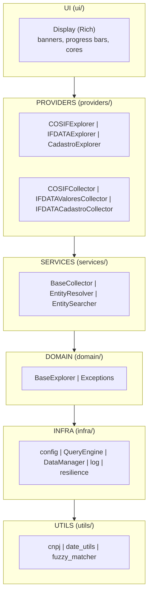
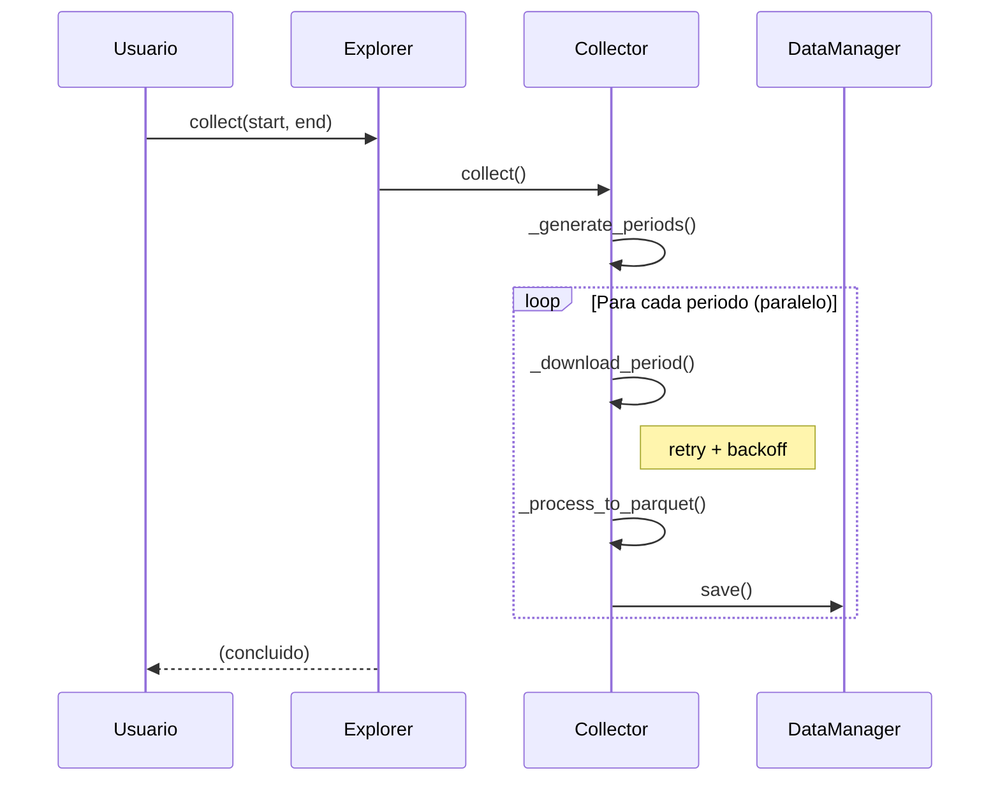
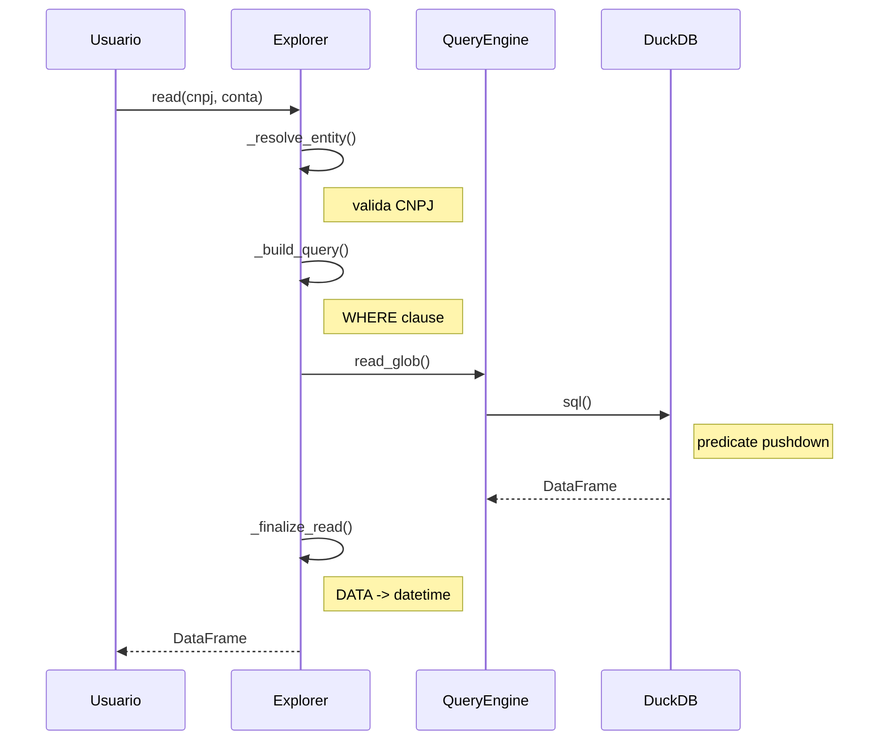
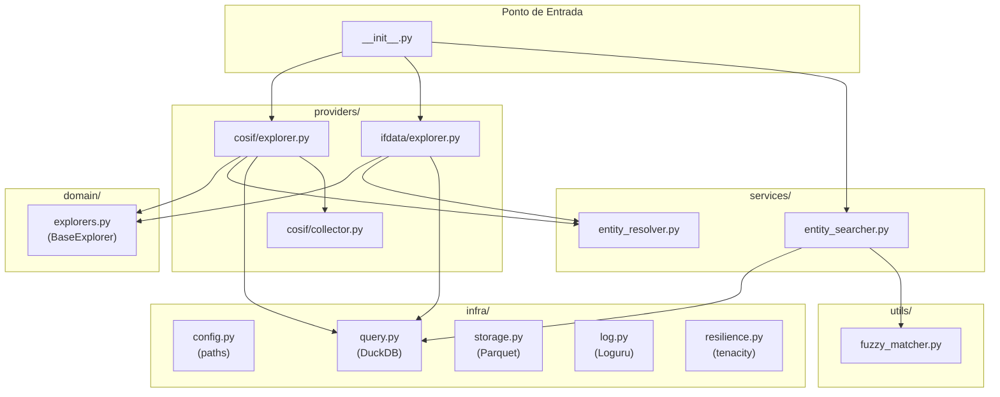

# Arquitetura

Visao geral da arquitetura interna da biblioteca `ifdata-bcb`.

## Diagrama de Camadas



## Camadas

### UI (`ui/`)

Responsavel pelo feedback visual ao usuario no terminal.

**Componentes**:
- `Display`: Singleton para banners, progress bars, mensagens formatadas
- Usa Rich para formatacao e cores

**Principio**: Separacao entre output visual (console) e logging tecnico (arquivo).

### Providers (`providers/`)

Implementacoes concretas para cada fonte de dados.

**Estrutura por provider**:
```
providers/
  cosif/
    __init__.py
    explorer.py    # COSIFExplorer
    collector.py   # COSIFCollector
  ifdata/
    __init__.py
    explorer.py    # IFDATAExplorer, CadastroExplorer
    collector.py   # IFDATAValoresCollector, IFDATACadastroCollector
  cadastro/
    __init__.py
    explorer.py    # Re-export de CadastroExplorer
```

### Services (`services/`)

Servicos transversais usados por multiplos providers.

**Componentes**:
- `BaseCollector`: Classe base com logica comum de coleta
- `EntityResolver`: Resolucao de identificadores (nome/CNPJ)
- `EntitySearcher`: Busca fuzzy em todas as fontes

### Domain (`domain/`)

Regras de negocio e contratos.

**Componentes**:
- `BaseExplorer`: Classe base abstrata para explorers
- `exceptions`: Hierarquia de excecoes customizadas

### Infra (`infra/`)

Infraestrutura tecnica e integracao com sistemas externos.

**Componentes**:
- `config`: Paths e configuracoes (BACEN_DATA_DIR)
- `query`: QueryEngine (DuckDB)
- `storage`: DataManager (Parquet)
- `log`: Sistema de logging (Loguru)
- `resilience`: Retry e backoff para APIs

### Utils (`utils/`)

Utilitarios puros e reutilizaveis.

**Componentes**:
- `cnpj`: Normalizacao de CNPJ
- `date_utils`: Geracao de ranges de datas
- `fuzzy_matcher`: Wrapper para thefuzz

## Design Patterns

### Template Method (BaseCollector)

O `BaseCollector` define o esqueleto do algoritmo de coleta, delegando passos especificos para subclasses:

```python
class BaseCollector(ABC):
    def collect(self, start, end):
        periods = self._generate_periods(start, end)  # Template
        for period in periods:
            csv_path = self._download_period(period)   # Abstract
            df = self._process_to_parquet(csv_path)    # Abstract
            self.dm.save(df, filename, subdir)         # Template

    @abstractmethod
    def _download_period(self, period): ...

    @abstractmethod
    def _process_to_parquet(self, csv_path): ...
```

### Strategy (Escopos COSIF)

O `COSIFExplorer` usa configuracao por escopo:

```python
_ESCOPOS = {
    "individual": {
        "subdir": "cosif/individual",
        "prefix": "cosif_ind",
    },
    "prudencial": {
        "subdir": "cosif/prudencial",
        "prefix": "cosif_prud",
    },
}
```

### Singleton (Display)

O `Display` usa double-checked locking para garantir instancia unica thread-safe:

```python
_display_instance = None
_display_lock = threading.Lock()

def get_display():
    global _display_instance
    if _display_instance is None:
        with _display_lock:
            if _display_instance is None:
                _display_instance = Display()
    return _display_instance
```

### Dependency Injection

Explorers e collectors aceitam dependencias via construtor:

```python
class COSIFExplorer(BaseExplorer):
    def __init__(
        self,
        query_engine: Optional[QueryEngine] = None,
        entity_resolver: Optional[EntityResolver] = None,
    ):
        self._qe = query_engine or QueryEngine()
        self._resolver = entity_resolver or EntityResolver()
```

### Decorator (retry)

O decorator `@retry` adiciona resiliencia a funcoes:

```python
@retry(max_attempts=3, delay=2.0)
def _download_single(self, url, output_path):
    response = requests.get(url, timeout=240)
    response.raise_for_status()
    output_path.write_bytes(response.content)
```

### Lazy Loading

Componentes sao carregados sob demanda:

```python
# Em __init__.py
_cosif = None

def __getattr__(name):
    global _cosif
    if name == "cosif":
        if _cosif is None:
            from ifdata_bcb.providers.cosif.explorer import COSIFExplorer
            _cosif = COSIFExplorer()
        return _cosif
```

## Fluxo de Coleta



### Paralelismo

A coleta usa `ThreadPoolExecutor` com staggered delay:

```python
with ThreadPoolExecutor(max_workers=4) as executor:
    futures = {
        executor.submit(self._process_single_period, p, i): p
        for i, p in enumerate(periods)
    }
    for future in as_completed(futures):
        registros, sucesso, erro = future.result()
```

O `staggered_delay` evita sobrecarga em APIs publicas:

```python
def staggered_delay(index, base_delay=0.5):
    if index == 0:
        return
    jitter = random.uniform(0, base_delay * 0.5)
    delay = (index * base_delay) + jitter
    time.sleep(delay)
```

## Fluxo de Consulta



### Predicate Pushdown

O DuckDB otimiza automaticamente:

```sql
-- Query gerada
SELECT * FROM '{cache}/cosif/prudencial/*.parquet'
WHERE CNPJ_8 = '60872504' AND DATA = 202412

-- DuckDB aplica filtros durante leitura do Parquet
-- Nao carrega dados desnecessarios em memoria
```

## Diagrama de Dependencias



## Extensibilidade

### Adicionando Novo Provider

1. Criar estrutura em `providers/novo/`
2. Implementar `Collector` herdando de `BaseCollector`
3. Implementar `Explorer` herdando de `BaseExplorer`
4. Registrar em `__init__.py` com lazy loading

### Customizando Comportamentos

Todas as classes aceitam dependencias via construtor:

```python
# QueryEngine customizado
from ifdata_bcb.infra import QueryEngine

qe = QueryEngine(base_path='/custom/path')
explorer = COSIFExplorer(query_engine=qe)
```

## Consideracoes de Thread Safety

### Thread-Safe

- `Display`: Singleton com double-checked locking
- `BaseCollector`: Contador de registros protegido por lock
- `QueryEngine`: Conexao DuckDB local por execucao
- `@lru_cache`: Cache thread-safe para `EntityResolver`

### Nao Thread-Safe (uso interno)

- Mapeamentos em memoria (`_name_mapping`)
- Estado de progress bars

### Recomendacao

Para uso multi-thread:
- Criar instancias separadas de Explorer por thread
- Ou sincronizar acesso externamente
