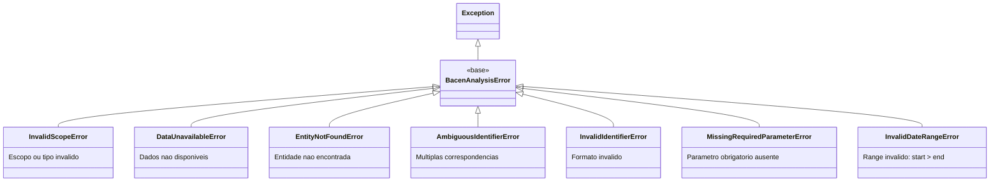

# Camada de Dominio

A camada de dominio contem as regras de negocio e contratos da biblioteca.

## BaseExplorer

### Responsabilidades

O `BaseExplorer` e a classe base abstrata para todos os explorers:

1. **Integracao**: Combina coleta (Collector) com consulta (QueryEngine)
2. **Resolucao**: Valida e resolve identificadores de entidades
3. **Normalizacao**: Padroniza formatos de entrada (datas, contas)
4. **Finalizacao**: Transforma dados de saida (DATA -> datetime)

### Localizacao

```
src/ifdata_bcb/domain/explorers.py
```

### Metodos Abstratos

Subclasses **devem** implementar:

```python
@abstractmethod
def _get_subdir(self) -> str:
    """Retorna o subdiretorio dos dados (ex: 'cosif/individual')."""
    ...

@abstractmethod
def _get_file_prefix(self) -> str:
    """Retorna o prefixo dos arquivos (ex: 'cosif_ind')."""
    ...

@abstractmethod
def collect(self, start: str, end: str, force: bool = False):
    """Coleta dados do BCB."""
    ...

@abstractmethod
def read(self, instituicao: str, start: str, end: str = None, conta = None, **kwargs):
    """Le dados com filtros. instituicao e start sao obrigatorios."""
    ...
```

### Metodos Concretos

Metodos ja implementados que subclasses herdam:

```python
def _normalize_dates(self, datas: DateInput) -> list[int]:
    """Normaliza datas para lista de inteiros YYYYMM."""

def _normalize_accounts(self, contas: AccountInput) -> list[str]:
    """Normaliza contas para lista de strings."""

def _resolve_entity(self, identificador: str) -> str:
    """Valida e retorna CNPJ_8."""

def _finalize_read(self, df: pd.DataFrame) -> pd.DataFrame:
    """Converte coluna DATA para datetime."""

def list_periods(self) -> list[int]:
    """Lista periodos disponiveis."""

def has_data(self) -> bool:
    """Verifica se existem dados."""

def describe(self) -> dict:
    """Retorna metadados dos dados disponiveis."""
```

### Integracao com QueryEngine

O explorer delega queries para o `QueryEngine`:

```python
class BaseExplorer(ABC):
    def __init__(self, query_engine=None, entity_resolver=None):
        self._qe = query_engine or QueryEngine()
        self._resolver = entity_resolver or EntityResolver()

    @property
    def query_engine(self) -> QueryEngine:
        return self._qe
```

### Exemplo de Implementacao

```python
class COSIFExplorer(BaseExplorer):
    def _get_subdir(self) -> str:
        return "cosif/individual"

    def _get_file_prefix(self) -> str:
        return "cosif_ind"

    def collect(self, start, end, force=False):
        collector = COSIFCollector()
        collector.collect(start, end, force=force)

    def read(self, instituicao, start, end=None, conta=None, escopo=None):
        # Validar parametros obrigatorios
        from ifdata_bcb.domain.exceptions import MissingRequiredParameterError
        if instituicao is None:
            raise MissingRequiredParameterError("instituicao", "Forneca CNPJ de 8 digitos.")
        if start is None:
            raise MissingRequiredParameterError("start", "Especifique o periodo (YYYY-MM).")

        # Construir WHERE clause
        where_parts = []
        cnpj = self._resolve_entity(instituicao)
        where_parts.append(f"CNPJ_8 = '{cnpj}'")

        # Executar query
        df = self._qe.read_glob(pattern, subdir, where=where_clause)

        # Finalizar (DATA -> datetime)
        return self._finalize_read(df)
```

## Sistema de Excecoes

### Hierarquia



### Localizacao

```
src/ifdata_bcb/domain/exceptions.py
```

### BacenAnalysisError

Excecao base para todos os erros da biblioteca:

```python
class BacenAnalysisError(Exception):
    """
    Excecao base para todos os erros na biblioteca.

    Permite capturar qualquer erro da biblioteca:
        except BacenAnalysisError:
    """
    pass
```

### InvalidScopeError

Levantada quando escopo ou tipo e invalido:

```python
class InvalidScopeError(BacenAnalysisError):
    def __init__(self, scope_name, value=None, valid_values=None, context=None):
        self.scope_name = scope_name
        self.value = value
        self.valid_values = valid_values

# Uso
raise InvalidScopeError(
    scope_name="escopo",
    value=None,
    valid_values=["individual", "prudencial"],
    context="Use escopo='prudencial' para conglomerados"
)

# Mensagem gerada:
# "O parametro 'escopo' e obrigatorio e deve ser especificado.
#  Contexto: Use escopo='prudencial' para conglomerados"
```

### DataUnavailableError

Levantada quando dados nao estao disponiveis:

```python
class DataUnavailableError(BacenAnalysisError):
    def __init__(self, entity, scope_type, reason=None, suggestions=None):
        self.entity = entity
        self.scope_type = scope_type
        self.reason = reason
        self.suggestions = suggestions

# Uso
raise DataUnavailableError(
    entity="60872504",
    scope_type="prudencial",
    reason="Instituicao nao reporta neste escopo",
    suggestions=["Tente escopo='individual'"]
)
```

### EntityNotFoundError

Levantada quando entidade nao e encontrada:

```python
class EntityNotFoundError(BacenAnalysisError):
    def __init__(self, identifier, suggestions=None):
        self.identifier = identifier
        self.suggestions = suggestions

# Uso
raise EntityNotFoundError(
    identifier="Banco XYZ",
    suggestions=["Verifique o nome", "Use bcb.search()"]
)
```

### AmbiguousIdentifierError

Levantada quando identificador tem multiplas correspondencias:

```python
class AmbiguousIdentifierError(BacenAnalysisError):
    def __init__(self, identifier, matches=None, suggestion=None):
        self.identifier = identifier
        self.matches = matches
        self.suggestion = suggestion

# Uso
raise AmbiguousIdentifierError(
    identifier="Itau",
    matches=["ITAU UNIBANCO S.A.", "BANCO ITAU BBA S.A."],
    suggestion="Use um nome mais completo ou o CNPJ"
)
```

### InvalidIdentifierError

Levantada quando formato do identificador e invalido:

```python
class InvalidIdentifierError(BacenAnalysisError):
    def __init__(self, identificador, suggestion=None):
        self.identificador = identificador
        self.suggestion = suggestion

# Uso
raise InvalidIdentifierError(
    identificador="Itau",
    suggestion="Use bcb.search('Itau') para encontrar o CNPJ."
)

# Mensagem gerada:
# "Identificador 'Itau' em formato invalido. Esperado CNPJ de 8 digitos.
#  Use bcb.search('Itau') para encontrar o CNPJ."
```

### MissingRequiredParameterError

Levantada quando um parametro obrigatorio nao foi fornecido:

```python
class MissingRequiredParameterError(BacenAnalysisError):
    def __init__(self, param_name, context=None):
        self.param_name = param_name
        self.context = context

# Uso
raise MissingRequiredParameterError(
    param_name="start",
    context="Especifique o periodo (formato YYYY-MM)."
)

# Mensagem gerada:
# "O parametro 'start' e obrigatorio. Especifique o periodo (formato YYYY-MM)."
```

### InvalidDateRangeError

Levantada quando o range de datas e invalido (start > end):

```python
class InvalidDateRangeError(BacenAnalysisError):
    def __init__(self, start, end):
        self.start = start
        self.end = end

# Uso
raise InvalidDateRangeError(start="2024-12", end="2024-01")

# Mensagem gerada:
# "Range de datas invalido: start='2024-12' > end='2024-01'."
```

### Tratamento de Erros

```python
from ifdata_bcb import (
    BacenAnalysisError,
    InvalidScopeError,
    InvalidIdentifierError,
    EntityNotFoundError,
    AmbiguousIdentifierError,
    MissingRequiredParameterError,
    InvalidDateRangeError,
)

# Capturar qualquer erro da biblioteca
try:
    df = bcb.cosif.read(instituicao='60872504', start='2024-12')
except BacenAnalysisError as e:
    print(f"Erro: {e}")

# Capturar erros especificos
try:
    df = bcb.cosif.read(instituicao='Itau', start='2024-12')
except InvalidIdentifierError as e:
    print(f"Identificador invalido: {e.identificador}")
    print(f"Sugestao: {e.suggestion}")
except AmbiguousIdentifierError as e:
    print(f"Multiplas correspondencias para: {e.identifier}")
    for match in e.matches:
        print(f"  - {match}")

# Capturar parametros obrigatorios ausentes
try:
    df = bcb.cosif.read(instituicao='60872504')  # Falta start!
except MissingRequiredParameterError as e:
    print(f"Parametro obrigatorio: {e.param_name}")

# Capturar range de datas invalido
try:
    df = bcb.cosif.read(instituicao='60872504', start='2024-12', end='2024-01')
except InvalidDateRangeError as e:
    print(f"Range invalido: {e.start} > {e.end}")
```

## Contratos e Interfaces

### Type Aliases

```python
# Tipos flexiveis para parametros de entrada
DateInput = Union[int, str, list[int], list[str]]
AccountInput = Union[str, list[str]]
```

### DateInput

Aceita:
- `int`: 202412
- `str`: '202412', '2024-12'
- `list[int]`: [202401, 202402]
- `list[str]`: ['2024-01', '2024-02']

### AccountInput

Aceita:
- `str`: 'TOTAL GERAL DO ATIVO'
- `list[str]`: ['TOTAL GERAL DO ATIVO', 'PATRIMONIO LIQUIDO']

### Normalizacao Interna

```python
def _normalize_dates(self, datas: DateInput) -> list[int]:
    """
    Normaliza datas para lista de inteiros YYYYMM.

    Args:
        datas: int, str, ou lista

    Returns:
        Lista de inteiros [202401, 202402, ...]
    """
    if not isinstance(datas, list):
        datas = [datas]

    result = []
    for d in datas:
        if isinstance(d, int):
            result.append(d)
        elif isinstance(d, str):
            clean = d.replace("-", "").replace("/", "")[:6]
            result.append(int(clean))
    return result
```

## Boas Praticas

### Validacao de Entrada

Sempre valide entradas antes de processar:

```python
def read(self, instituicao, start, end=None, escopo=None, ...):
    from ifdata_bcb.domain.exceptions import MissingRequiredParameterError, InvalidDateRangeError

    # 1. Validar parametros obrigatorios
    if instituicao is None:
        raise MissingRequiredParameterError("instituicao", "Forneca CNPJ de 8 digitos.")
    if start is None:
        raise MissingRequiredParameterError("start", "Especifique o periodo (YYYY-MM).")

    # 2. Validar range de datas
    if end is not None:
        start_int = self._normalize_dates(start)[0]
        end_int = self._normalize_dates(end)[0]
        if start_int > end_int:
            raise InvalidDateRangeError(start, end)

    # 3. Validar e resolver identificador
    cnpj = self._resolve_entity(instituicao)  # Levanta InvalidIdentifierError

    # 4. Processar...
```

### Mensagens de Erro Informativas

Inclua contexto e sugestoes:

```python
raise InvalidIdentifierError(
    identificador=identificador,
    suggestion=f"Use bcb.search('{identificador}') para encontrar o CNPJ."
)
```

### Exports Publicos

O `__init__.py` raiz exporta excecoes para uso publico:

```python
from ifdata_bcb.domain.exceptions import (
    AmbiguousIdentifierError,
    BacenAnalysisError,
    DataUnavailableError,
    EntityNotFoundError,
    InvalidDateRangeError,
    InvalidIdentifierError,
    InvalidScopeError,
    MissingRequiredParameterError,
)

__all__ = [
    "BacenAnalysisError",
    "InvalidScopeError",
    "MissingRequiredParameterError",
    "InvalidDateRangeError",
    # ...
]
```
